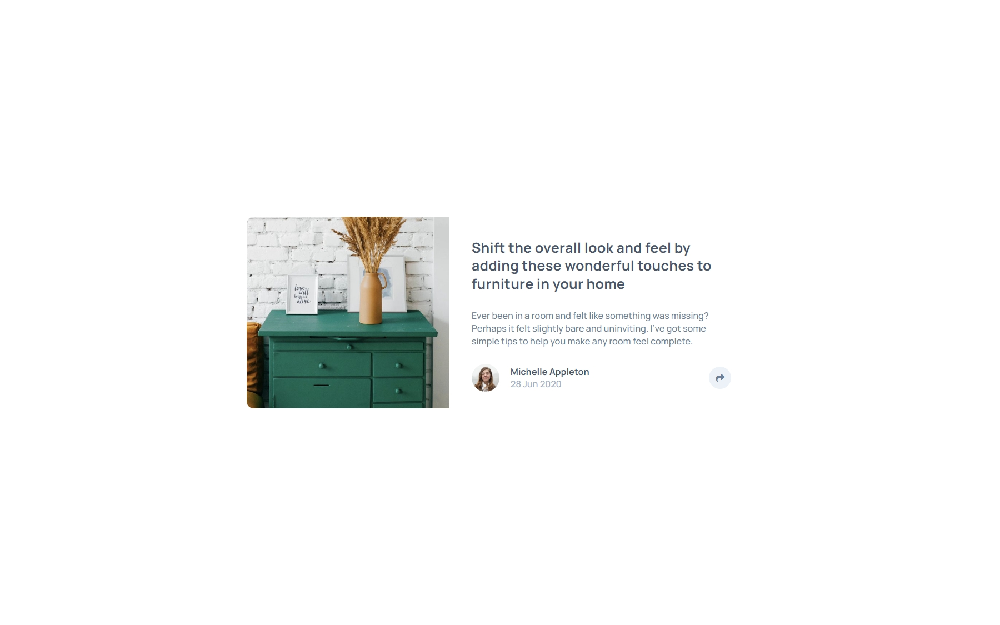
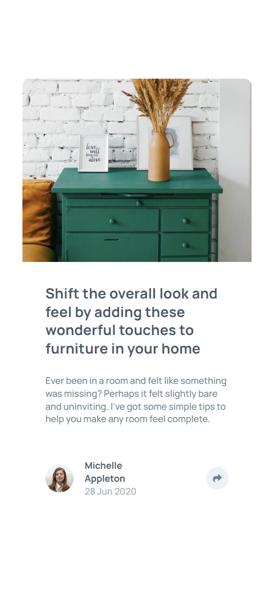
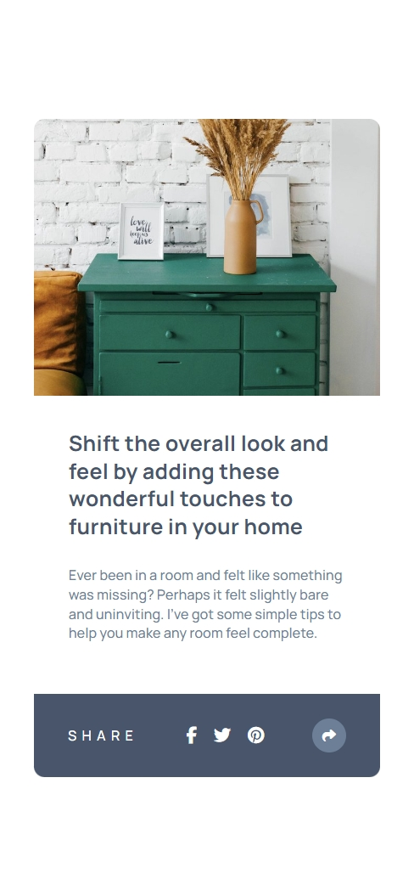

# Frontend Mentor - Article preview component solution

This is a solution to the [Article preview component challenge on Frontend Mentor](https://www.frontendmentor.io/solutions/responsive-article-preview-card-with-onclick-dom-manipulation-k19gc7g83x). Frontend Mentor challenges help you improve your coding skills by building realistic projects.

## Table of contents

- [Overview](#overview)
  - [The challenge](#the-challenge)
  - [Screenshot](#screenshot)
  - [Links](#links)
- [My process](#my-process)
  - [Built with](#built-with)
  - [What I learned](#what-i-learned)
  - [Continued development](#continued-development)
  - [Useful resources](#useful-resources)
- [Author](#author)

## Overview

### The challenge

Users should be able to:

- View the optimal layout for the component depending on their device's screen size
- See the social media share links when they click the share icon

### Screenshot





### Links

- Solution URL: [Article Preview Card Solution](https://www.frontendmentor.io/solutions/responsive-article-preview-card-with-onclick-dom-manipulation-k19gc7g83x)
- Live Site URL: [Live Site](https://rishabhsikka3.github.io/article-preview-card/)

## My process

### Built with

- Semantic HTML5 markup
- CSS custom properties (CSS variables)
- Flexbox
- Mobile-first workflow
- Responsive design
- CSS positioning for tooltips and overlays
- Font Awesome icons
- Google Fonts (Manrope)

### What I learned

Working on this project helped me understand several key concepts:

**1. CSS Positioning and Overlays**
I learned how to create responsive overlays that adapt to different screen sizes. The mobile share overlay required careful positioning relative to its containing elements:

```css
.mobile-share-overlay {
  position: absolute;
  left: -12.5%;
  right: -12.5%;
  bottom: -24px;
  background-color: var(--grey-900);
  /* ... */
}
```

**2. Responsive Interactive States**
Creating different interaction patterns for desktop (tooltip) vs mobile (overlay) taught me about conditional styling based on screen size:

```css
@media (min-width: 768px) {
  .mobile-share-overlay {
    display: none !important;
  }
}
```

**3. JavaScript Event Handling**
Managing different behaviors for mobile and desktop required careful event handling:

```js
shareIcon.addEventListener("click", (e) => {
  const isMobile = window.innerWidth <= 768;

  if (isMobile) {
    profile.classList.toggle("mobile-share-active");
  } else {
    tooltip.classList.toggle("hide-tooltip", !isTooltipVisible);
  }
});
```

**4. CSS Percentage Calculations in Positioning**
I discovered that percentage values in CSS positioning are relative to the containing block, not the ultimate parent. This is why `-12.5%` was needed instead of `-10%` to achieve full-width coverage:

- Content width: 80% of card
- To extend by 10% of card width: 10% ÷ 80% = 12.5% of content width

### Continued development

Areas I want to focus on in future projects:

- **Advanced CSS positioning**: Continue exploring complex positioning scenarios and understanding percentage calculations in different contexts
- **Accessibility improvements**: Adding proper ARIA labels, keyboard navigation, and focus management for interactive components
- **Animation and transitions**: Adding smooth transitions between states to enhance user experience
- **Touch interactions**: Implementing better touch handling for mobile devices

### Useful resources

- [MDN CSS Position](https://developer.mozilla.org/en-US/docs/Web/CSS/position) - Helped me understand absolute positioning and containing blocks
- [CSS-Tricks Flexbox Guide](https://css-tricks.com/snippets/css/a-guide-to-flexbox/) - Essential reference for flexbox layouts
- [Font Awesome Documentation](https://fontawesome.com/docs) - For implementing social media icons
- [MDN addEventListener](https://developer.mozilla.org/en-US/docs/Web/API/EventTarget/addEventListener) - Reference for event handling patterns

## Author

- Name – Rishabh Sikka
- Frontend Mentor – [@RishabhSikka3](https://www.frontendmentor.io/profile/RishabhSikka3)
